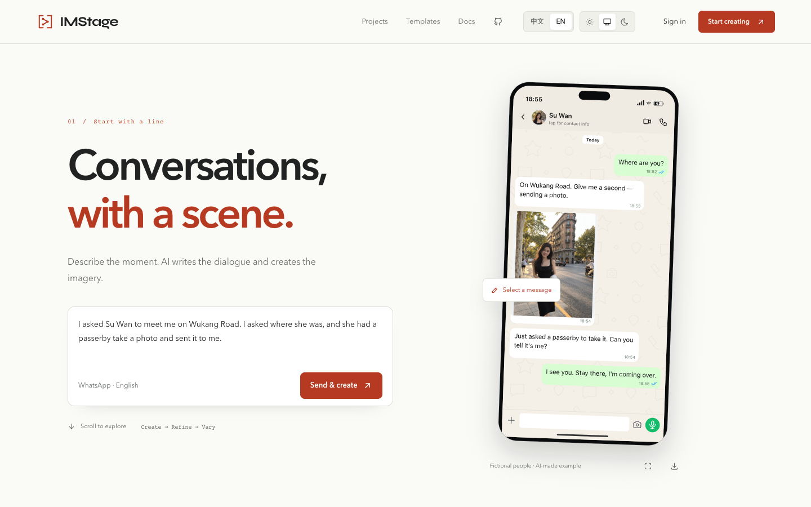

# IMStage

Create conversations. Refine every detail.

[Try IMStage →](https://imstage.org/?lang=en) · [简体中文](README.zh-CN.md) · [Contribute](CONTRIBUTING.md)



Make product demos, teaching examples and fictional stories with chat scenes.
Start with an idea, edit the scene directly, and export the frame you need.

- **Edit directly.** Change messages, people, avatars, timestamps and device settings. Undo mistakes and keep separate local sessions.
- **Create with words.** The hosted Agent can draft and revise a scene after sign-in. Reference screenshots support reconstruction and focused edits.
- **Reuse your work.** Save editable templates, expose names and photos as variables, and create project variations with shared rules. Customize the layout beyond app skins.
- **Export the result.** Download a normal frame or a long PNG, or keep the editable scene as JSON. Preview and export share one renderer.
- **Use your own tools.** Self-host the account API and Agent, or connect a client to the authenticated MCP service.

Chinese examples use WeChat; English examples use WhatsApp. Scroll through a
scene, change a line and explore variations. **Send & create** opens a fresh
workspace and starts your request after sign-in. Your scenes and people save
automatically; local drafts keep edits available when a cloud save fails.

## Run locally

Use Node.js **22.18–22.x**.

```sh
npm ci
npm run dev
```

Open [localhost:4417](http://127.0.0.1:4417). To build and run the production app:

```sh
npm run build
npm start
```

Configure server-side provider credentials to use the Agent. Manual editing and
PNG export work without provider keys.

## Hosting and integrations

The hosted website uses Vercel for the frontend and a persistent server for
accounts, saved scenes and Agent requests. Provider secrets stay on the server.
Local sessions stay in the current browser. Signed-in scene and people edits
automatically sync to the server. AI requests send their scene, attachments and
instruction to the configured providers.

MCP uses an **administrator-configured instance token and its own scene store**.
Its batch tools atomically save content supplied by the calling AI; Web project batches run the hosted Agent. It does not share Web account sessions or the Web saved-scene library. Managed
per-customer API keys, billing and email password recovery are not implemented.

[Templates and batch creation](docs/templates-and-projects.md) · [Deploy and operate](deploy/README.md) · [Account API](services/api/README.md) · [Agent configuration](services/agent/README.md) · [MCP tools](services/mcp/README.md)

## Development

```sh
npm test
npm run test:ui  # Playwright; installed Google Chrome by default
```

For bundled Chromium, run `npx playwright install chromium`, then
`IMSTAGE_BROWSER=chromium npm run test:ui`. See [contributing](CONTRIBUTING.md).

Templates approximate platform UI; screenshot reconstruction can need manual
correction. Built-in conversations and portraits are fictional. Use authorized
assets and do not present generated scenes as evidence of real conversations.

[MIT](LICENSE). Independent of the messaging platforms shown.
