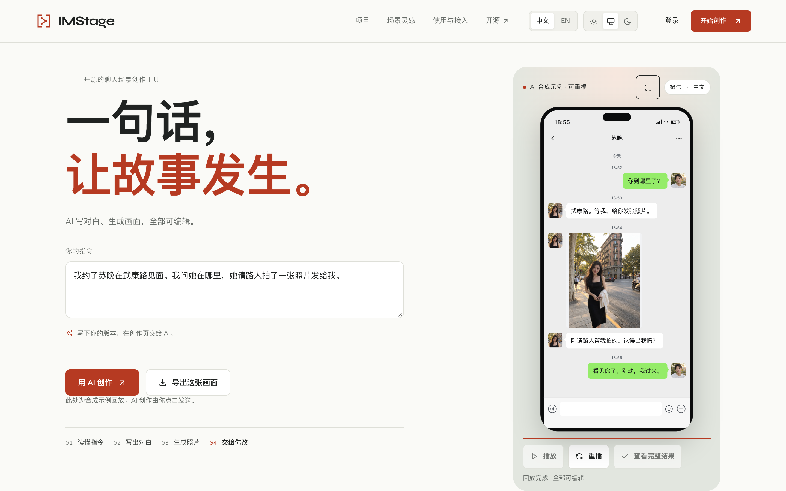

# IMStage

一句话，创作对白、照片和可编辑的聊天画面。

[打开 IMStage →](https://project-91bgj.vercel.app/?lang=zh) · [English](README.md) · [参与贡献](CONTRIBUTING.md)



为产品演示、教学示例和虚构故事制作聊天场景。看一段故事展开，让 Agent 接着创作，再导出需要的画面。

- **直接编辑。** 修改消息、人物、头像、时间和设备状态；支持撤销和独立的本机会话。
- **用文字创作。** 登录后，让 Agent 生成或修改场景；参考截图可用于重建和局部编辑。
- **导出成品。** 下载普通截图、完整长图或可编辑的 JSON。预览和 PNG 使用同一个渲染器。
- **接入自己的工具。** 自托管账号 API 与 Agent，或通过认证后的 MCP 服务创建和渲染场景。

中文示例使用微信，英文示例使用 WhatsApp；支持浅色、深色和跟随系统。首页回放 AI 合成的武康路故事，可以暂停、放大照片并导出 PNG。「用 AI 创作」会把场景和指令带入新会话，由你决定何时发送。

## 本地运行

需要 Node.js **22.18–22.x**。

```sh
npm ci
npm run dev
```

打开 [localhost:4417](http://127.0.0.1:4417)。生产构建与启动：

```sh
npm run build
npm start
```

使用 Agent 需要在服务端配置模型密钥。手动编辑和 PNG 导出不需要模型密钥。

## 部署与接入

官网前端部署在 Vercel，账号、作品保存与 Agent 请求由持久化服务器处理。模型密钥仅保存在服务端。

本地草稿保存在当前浏览器；主动保存到账号或发起 AI 请求时，相关场景、图片和指令会发送至服务器及配置的模型服务。

MCP 使用**管理员配置的实例令牌和独立场景库**，不共用 Web 登录会话或“我的作品”。按客户分发的商业 API key、计费和邮件密码找回尚未实现。

[部署与运维](deploy/README.md) · [账号 API](services/api/README.md) · [Agent 配置](services/agent/README.md) · [MCP 工具](services/mcp/README.md)

## 开发验证

```sh
npm test
npm run test:ui  # Playwright，默认使用已安装的 Google Chrome
```

使用自带 Chromium：先运行 `npx playwright install chromium`，再执行
`IMSTAGE_BROWSER=chromium npm run test:ui`。开发约定见[贡献指南](CONTRIBUTING.md)。

模板是平台界面的视觉近似，截图重建可能需要手动校正。内置对话与头像均为虚构素材；请使用有权使用的内容，不将生成画面作为真实聊天的证据。

采用 [MIT](LICENSE) 许可证，与所展示的聊天平台无隶属关系。
