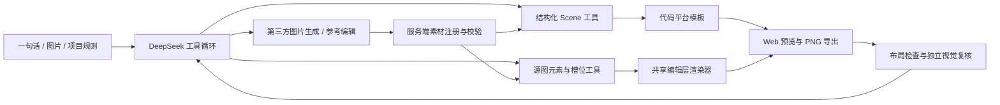

# Agent 驱动的真实聊天场景：实现与验收设计

状态：实现中；不能把本设计或测试命令存在视为 ALL PASS。

## 不变量

- Agent 负责意图、内容、资产生成与受约束的工具调用。平台模板负责布局、字体、头像遮罩、卡片、系统事件和截图导出。
- 同一作品的预览和导出复用渲染实现。截图保留模式与原生结构化模式共享 Agent，但不假装原图已完整重建。
- 真实数据集的期望、答案、保护区域及分数不得进入生成 Agent。元素分析只读取源图与 OCR。
- 所有工具图像带 source/render 标记、图像版本及坐标系。源图像素为测量基准，归一化转换在工具内部完成。
- 文字替换优先复用源图文字样式和元素范围；素材替换保持槽位。无法满足约束时产生具体失败，不能悄悄缩小字体或扩张槽位。
- 完成要求实际修改、最新成功预览、素材就绪和所声明任务项完成。模型完成文案不等于成功。

## 实现边界

新增源图元素分析和语义文字替换，文本节点提供稳定 ID、样式测量、坐标与置信度；图片槽位提供锁定边界。保留低层编辑作为高级补充。多处替换显式枚举匹配，不把不同人物的同名字串盲目视为同一实体。

圆形遮罩是显式形状，与图片分辨率无关。平台样式以代码模板维护，用户可覆盖项目默认值。生成/编辑素材记录实际服务返回的 ID 和字节，不能只凭模型声称生成。

## 验收

1. 合成回归测试覆盖坐标、富文本保留、遮罩、过期预览、失败部分结果和素材来源。
2. 固定素材截图集逐例运行真实 DeepSeek，禁止读取金标或降低阈值。
3. 独立视觉复核对比源图、任务及最新输出；硬约束与视觉复核均通过才算用例通过。
4. 另外运行真实生图/参考编辑与跨平台生成；固定素材集通过不代表这些能力通过。
5. 人工金标仍由用户批准。待审参考答案修正须单独记录原因和版本，不得为迎合当前输出调整答案。

## 执行架构

这里有两种明确的作品模式：

- **结构化创作**：Scene 存人物、消息、时间、媒体引用和背景。平台模板决定标题栏、消息气泡、头像、时间与已读状态、输入栏。切换平台时内容保持，模板改变。Web 预览与导出使用同一个 `SceneView`。
- **保留原截图编辑**：源图是不可变底图，Agent 使用 OCR 元素与源像素测量工具修改指定区域。Web 与数据集共用编辑层渲染器。它目前不能把任意截图完整还原成 Scene，也不能用保留底图的方式完成跨平台重排。

当前六种平台配置为微信、WhatsApp、Instagram、iMessage、小红书和 Slack；其中微信、WhatsApp、Instagram 的头部、头像、时间和输入栏有专门处理。它们是项目维护的近似模板，并非各平台所有版本的像素级认证。设备、系统版本、主题和平台模板版本应成为后续独立的覆盖矩阵，不能由少量 iOS 截图推断桌面端或 Android 已通过。

## Agent 工具与状态约束

- `read_elements` / `replace_text(s)`：源图识别、精确选择与统一文字替换，字号、底色和位置由工具测量。长名称使用原字符串，让渲染器换行。
- `list_content_frames` / `find_avatars` / `find_album` / `find_card_image`：分别测量消息图片、头像、相册槽位与位置卡片地图，保留卡片标题、时间底栏和相册分隔线。图片放置必须引用已测量槽位。
- `list_message_frames` / `replace_message_text`：当前专用于 WhatsApp 正文与时间分离。时间、已读标记作为保护区域；长词尽量完整换行，不能为容纳文字直接覆盖时间。
- `generate_image`：真实第三方调用与素材字节校验。局部编辑生成新素材，避免共用同一素材的其他消息被意外修改。未使用的新素材与失败调用都影响完成状态。
- `render_preview` / `inspect_render`：当前版本渲染与观察。源图观察不能冒充结果预览；过期版本不能用于结束截图编辑。
- `finish`：截图模式要求有实际修改、素材有效和最新布局检查通过。这里的“完成”只说明运行协议完成，**不等于用户需求或视觉验收通过**。

项目规则仍是内容生成约束。涉及权限、选中范围、尺寸、素材生命周期和导出格式的约束由服务端校验，不能只写在提示词里。

## 验收分层与尚未解决的问题

验收必须分别报告运行完成率、自动检查通过率与视觉通过率。固定替换素材集检测定位/渲染；真实文生图与参考编辑另行验证服务调用与素材绑定。模型文案、mock 工具、合成单元测试、一次生图成功不能替代真实截图集验收。

当前自动评分以编辑层内容和位置匹配为主，存在两类需要分开跟踪的问题：

1. **产品缺陷**：长文本与图标碰撞、复杂翻译重排、非平色背景恢复，以及被悬浮按钮遮挡的消息边界。纯上下像素插值只能可靠处理平色或简单渐变，不能宣称照片背景无损恢复。
2. **评测合同缺陷**：原字被保留时，最终可见句子不一定全部存在于单个新增文字层；分层不同或中英文空格不同也会导致严格文本失败。后续应增加独立的最终图像内容检查，并保留未修改区域、尺寸和素材检查。新的合同需要单独版本和审阅，不能事后按模型输出修改当前答案。

下一步实现边界是可重排的原生组件：联系人资料块、按钮组、翻译提示、消息正文与收据。它们应接收内容字段，由模板决定字体、间距、图标与排版，并在放不下时报告具体溢出。为保持原截图像素不变，局部重排需明确可变区域，不能默许扩大擦除范围。

运行证据和逐例原图/结果保留在忽略的 `.local/` 中。私有聊天、源图、密钥、完整提示词和金标不进入公开仓库。部分失败输出可以查看，但不能被标记为好或金标；运行版本变化后旧结果不得展示为本轮报告。
