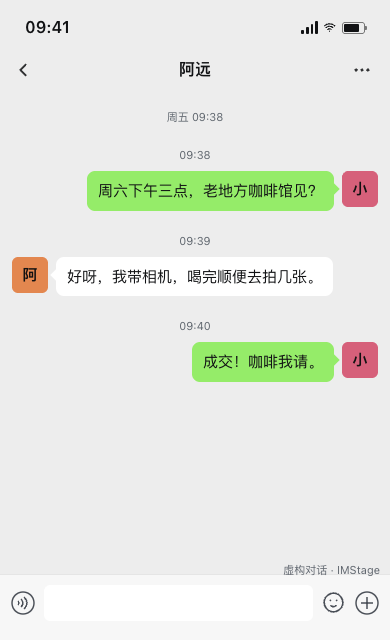
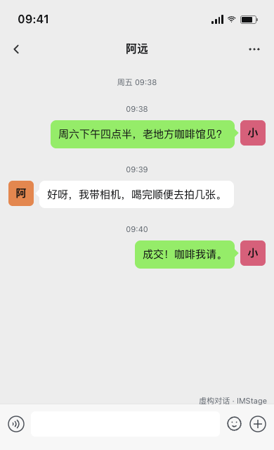
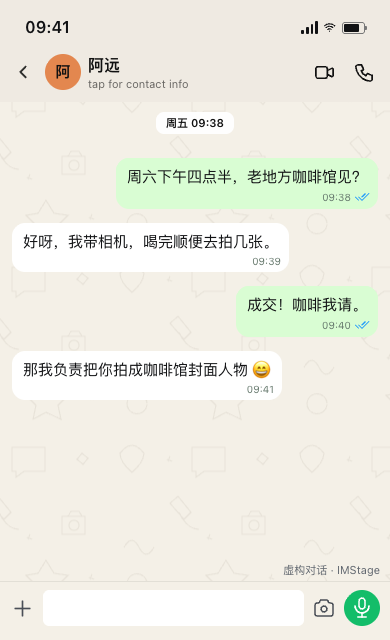

# MCP 验证记录

日期：2026-09-21。基线：`32523b03dd1c4fe32dc196f787c0f21320e63140`，分支：`codex/chatgpt-mcp`。

## 已验证

- `npm run test:mcp`：41 tests，41 passed，0 skipped。使用官方 MCP SDK 真实 HTTP 客户端；包含鉴权、输入限制、原子修改、并发冲突、幂等重试、持久化、历史版本、真实 Chromium PNG 渲染和资源读取。
- `npm test`：345 tests，345 passed，0 skipped。
- `npm run build`：TypeScript 和 Vite production build 通过。
- MCP Apps 组件在 Chromium 的模拟宿主内完成初始化、图片显示、携带同一作品 ID 的追问消息、PNG 下载请求和错误恢复。此项不代表真实 ChatGPT 兼容性已完成验收。
- 独立 loopback 常驻服务完成三轮真实 MCP 调用：微信初稿 → 只改约定时间 → 增加回复并改为 WhatsApp；同一作品的 revisions 为 1、2、3，未指定元素保持不变，初始版本可读取，PNG resource 可下载。
- 重启本任务常驻服务后，重放相同幂等请求仍返回同一作品和三个既有修订；无凭据调用 `/mcp` 返回 HTTP 401。
- 六个平台的共享 Web HTML 渲染检查通过；使用 Web `SceneView`、同一份 CSS 和同一 `validateScene`，没有另外维护一套页面模板。

本机验收为合成内容。机器可读记录：[live-acceptance.json](evidence/mcp/live-acceptance.json)。

| 初稿 | 只调整约定时间 | 增加回复并调整平台 |
| --- | --- | --- |
|  |  |  |

## 私有安装进度

- 用户确认后，已在实际 ChatGPT 设置中开启 Developer mode，并读回为 on。
- 已创建 IMStage Personal 私有 tunnel，刷新 Platform 页面后确认只关联当前个人组织和个人 ChatGPT 工作区。账号与 tunnel 标识仅保留在本机私有配置。
- 已生成 IMStage Tunnel Runtime 凭据，保存页面确认只有 Tunnels Read、Use 两项权限，其他能力均为 None。凭据尚未成功写入本机私有文件：TextEdit 保存连续超时，Computer Use 拒绝操作 Terminal；已将保存步骤交给用户，密钥未写入仓库或对话输出。

## 尚未完成

- 运行凭据的本机私有保存及隧道连接就绪。
- 在 ChatGPT 创建并安装 IMStage，发现五个工具。
- 实际 ChatGPT 对话的三轮创作、组件内追问、宿主下载验收。

安装已获得授权，剩余项目等待凭据安全保存后继续，不能以 SDK 或模拟宿主测试替代。此分支依赖尚未合入主干的编辑器工作，不代表 GitHub `main` 或公开 Vercel 网站已经发布 MCP。

## 运行边界

个人单所有者服务；使用隔离 SQLite，凭据只在本机私有配置中。无外部模型调用，无 Web 用户数据库读取，不接受远程图像 URL。原图截图编辑层不在此 MCP 版本范围内。PNG 缓存保留最近 50 个，旧作品版本仍可重新渲染。长图有像素与高度限制，超限返回可操作错误，不静默裁掉内容。
